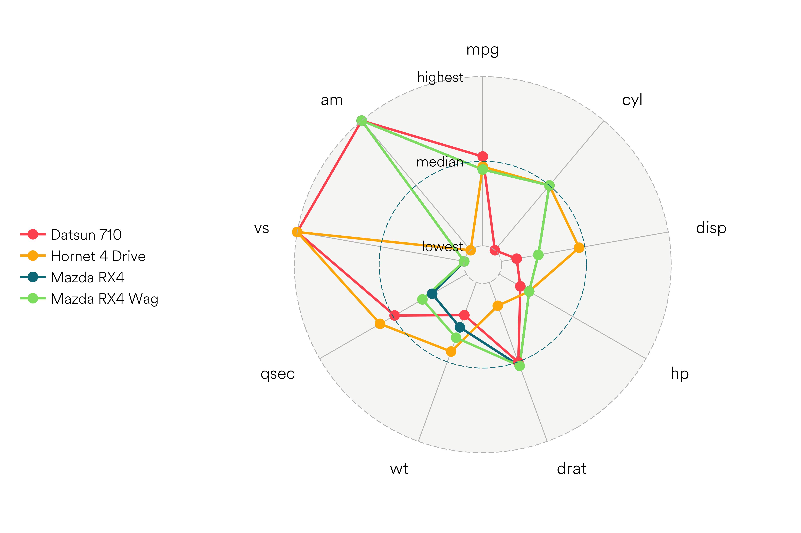

# ggradar


ggradar allows you to build radar charts with ggplot2. This package is based on [Paul Williamson's](http://rstudio-pubs-static.s3.amazonaws.com/5795_e6e6411731bb4f1b9cc7eb49499c2082.html) code, with new aesthetics and compatibility with ggplot2 2.0.

It was inspired by [d3radaR](http://www.buildingwidgets.com/blog/2015/12/9/week-49-d3radarr), an htmlwidget built by [timelyportfolio](https://github.com/timelyportfolio).


## Install ggradar


```r
devtools::install_github("ricardo-bion/ggradar", 
                          dependencies=TRUE)
```

## Use ggradar


```r
library(ggradar)

suppressPackageStartupMessages(library(dplyr))
library(scales)

mtcars %>%
     add_rownames( var = "group" ) %>%
     mutate_each(funs(rescale), -group) %>%
     tail(4) %>% select(1:10) -> mtcars_radar

ggradar(mtcars_radar) 
```




```r
knitr::kable(mtcars_radar,format="markdown") 
```


|group          |       mpg| cyl|      disp|        hp|      drat|        wt|      qsec| vs| am|
|:--------------|---------:|---:|---------:|---------:|---------:|---------:|---------:|--:|--:|
|Ford Pantera L | 0.2297872| 1.0| 0.6981791| 0.7491166| 0.6728111| 0.4236768| 0.0000000|  0|  1|
|Ferrari Dino   | 0.3957447| 0.5| 0.1843352| 0.4346290| 0.3963134| 0.3214012| 0.1190476|  0|  1|
|Maserati Bora  | 0.1957447| 1.0| 0.5734597| 1.0000000| 0.3594470| 0.5259524| 0.0119048|  0|  1|
|Volvo 142E     | 0.4680851| 0.0| 0.1244699| 0.2014134| 0.6221198| 0.3239581| 0.4880952|  1|  1|

## Custom fonts

This package requires the Airbnb font and the extrafont package.


```r
# configured to work on a Mac, change directory to Unix or Windows
download.file("https://github.com/ricardo-bion/ggtech/blob/master/Circular%20Air-Light%203.46.45%20PM.ttf", "~/Circular Air-Light 3.46.45 PM.ttf", method="curl")

extrafont::font_import(pattern = 'Circular', prompt=FALSE)
```
